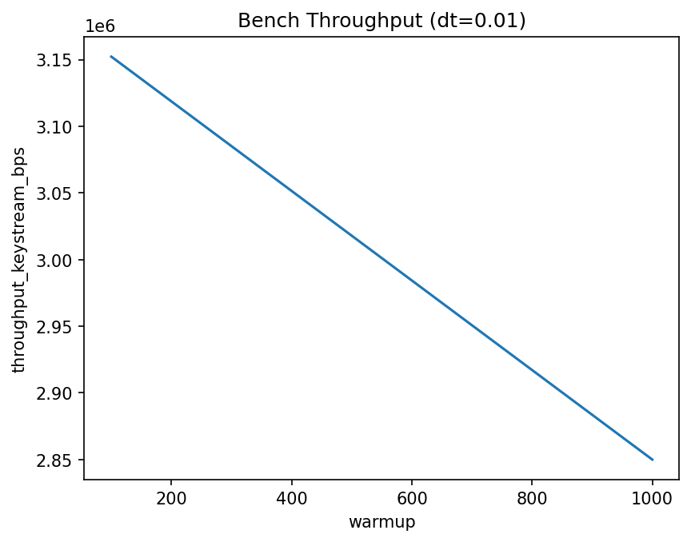
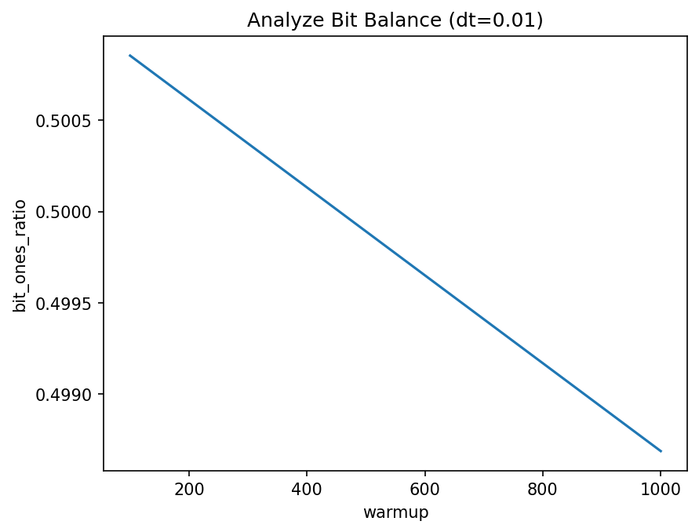
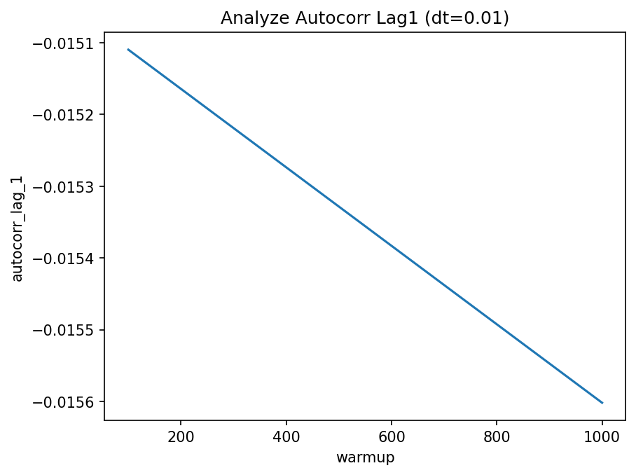
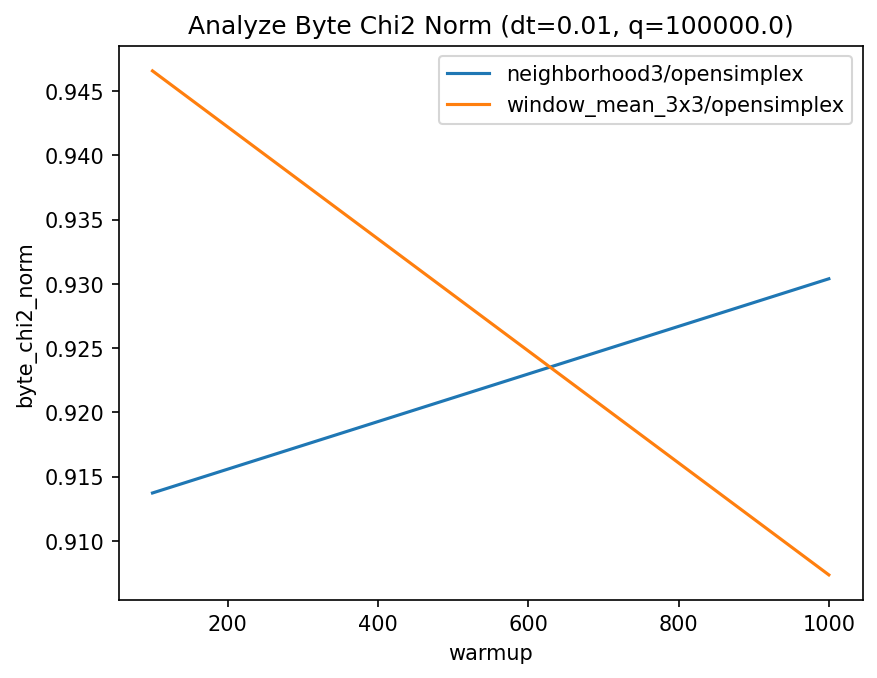

# ChaosCrypto WP2 – Report

## Inputs
- Benchmark CSV: `results.csv` (2 variants aggregated)
- Analyze CSV: `analysis.csv` (2 variants aggregated)
- Token: not stored; only fingerprints in source CSV

## Scope
- Profile: alice
- Coord: (12,34)
- nbytes: 4096
- Varying parameters:
  - dt: [0.01]
  - warmup: [100, 1000]
  - quant_k: [100000.0]
  - size: [128]
  - scale: [0.1]

## Benchmark Summary
Top throughput (mean over repeats):

| dt | warmup | quant_k | size | scale | mean_t_keystream_s | mean_tp_bps | keystream_sha256 |
|---|---|---|---|---|---|---|---|
| 0.01 | 100 | 100000.0 | 128 | 0.1 | 0.00129993 | 3.15e+06 | 850a5a0049420120022bb1c7f5d37fc40bdc33577af41ec810c936ab4ab2ec36 |
| 0.01 | 1000 | 100000.0 | 128 | 0.1 | 0.00143864 | 2.85e+06 | b8716987898d2d8a84c4fa23df62e0b86bc2f869443a64b5fe871cdcf0430f5e |

## Analyze Summary
- Bit ones ratio min/mean/max: (0.498688, 0.499771, 0.500854)
- Runs norm diff min/mean/max: (0.007539, 0.007662, 0.007785)
- Byte chi2 norm min/mean/max: (0.913725, 0.922059, 0.930392)
- Autocorr lag1 min/mean/max: (-0.015602, -0.015356, -0.01511)

| dt | warmup | quant_k | size | scale | bit_ones_ratio | byte_chi2_norm | runs_norm_diff | autocorr_lag_1 | keystream_sha256 |
|---|---|---|---|---|---|---|---|---|---|
| 0.01 | 100 | 100000.0 | 128 | 0.1 | 0.500854 | 0.913725 | 0.007539 | -0.015110 | 850a5a0049420120022bb1c7f5d37fc40bdc33577af41ec810c936ab4ab2ec36 |
| 0.01 | 1000 | 100000.0 | 128 | 0.1 | 0.498688 | 0.930392 | 0.007785 | -0.015602 | b8716987898d2d8a84c4fa23df62e0b86bc2f869443a64b5fe871cdcf0430f5e |

## Best Candidates (heuristic score)
| dt | warmup | quant_k | size | scale | score | perf_score | rand_score | bit_ones_ratio | autocorr_lag_1 | runs_norm_diff | byte_chi2_norm |
|---|---|---|---|---|---|---|---|---|---|---|---|
| 0.01 | 100 | 100000.0 | 128 | 0.1 | 0.940649 | 1.000000 | 0.901081 | 0.500854 | -0.015110 | 0.007539 | 0.913725 |
| 0.01 | 1000 | 100000.0 | 128 | 0.1 | 0.909943 | 0.904127 | 0.913820 | 0.498688 | -0.015602 | 0.007785 | 0.930392 |

## Plots

## Appendix
- CSV columns: benchmark includes timing/throughput; analyze includes keystream statistics.
- Reproducibility: same config → identical hashes/metrics.