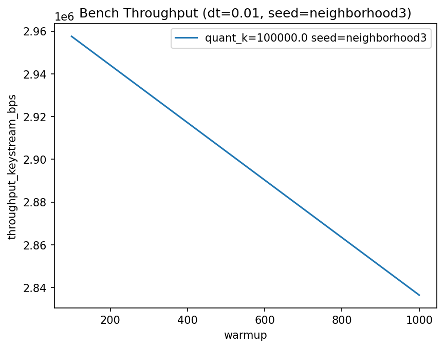
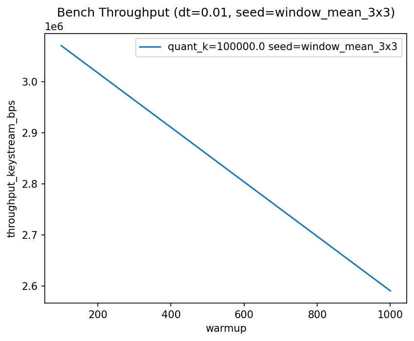
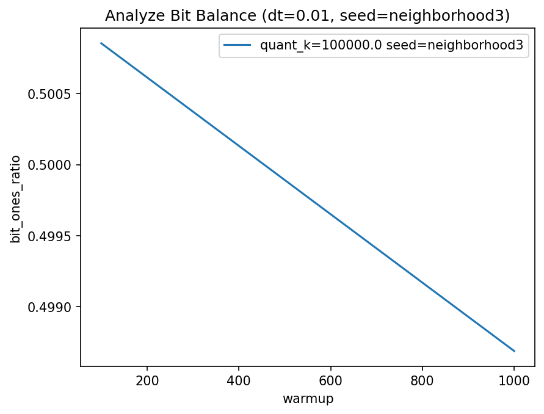
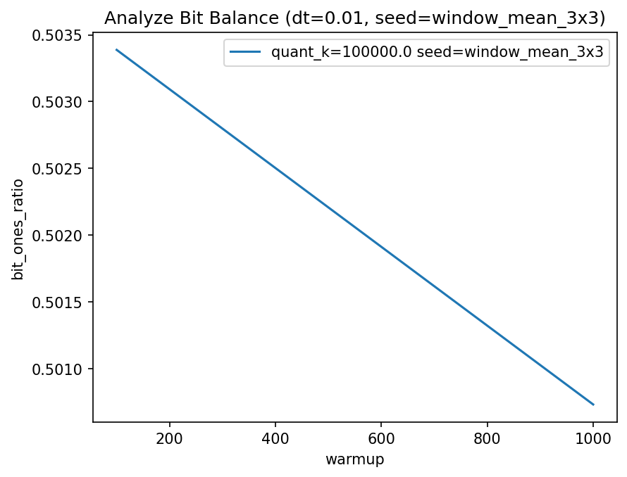
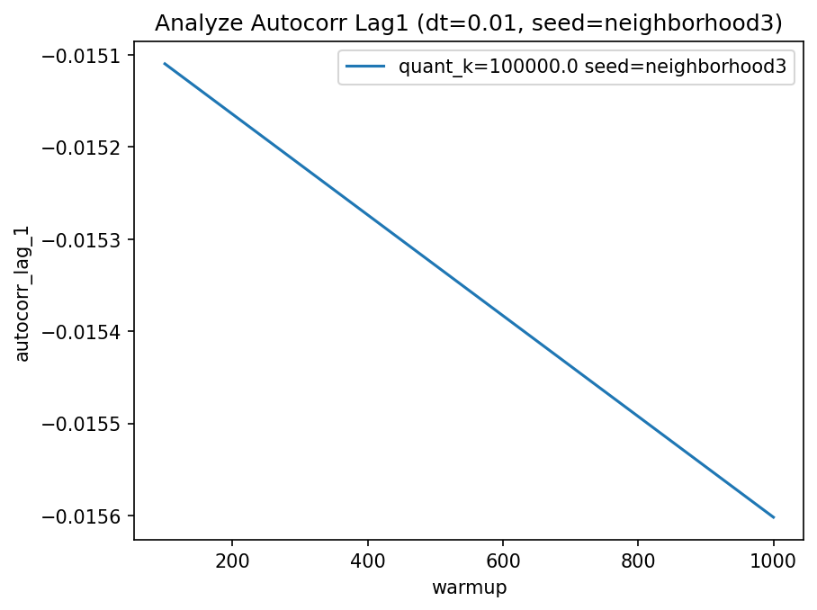
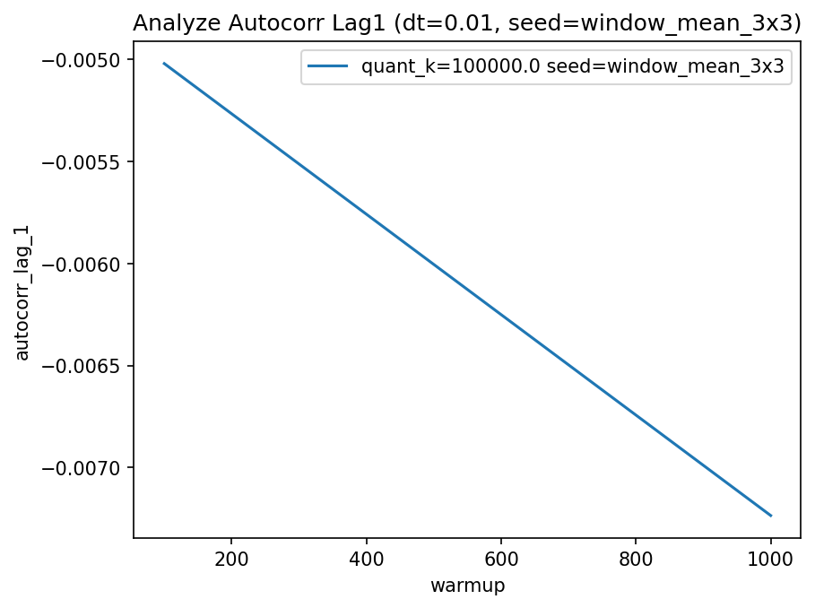
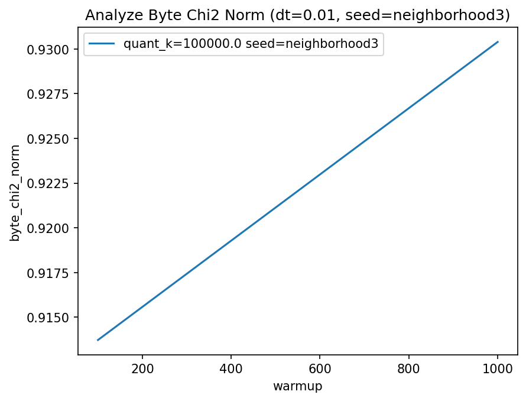
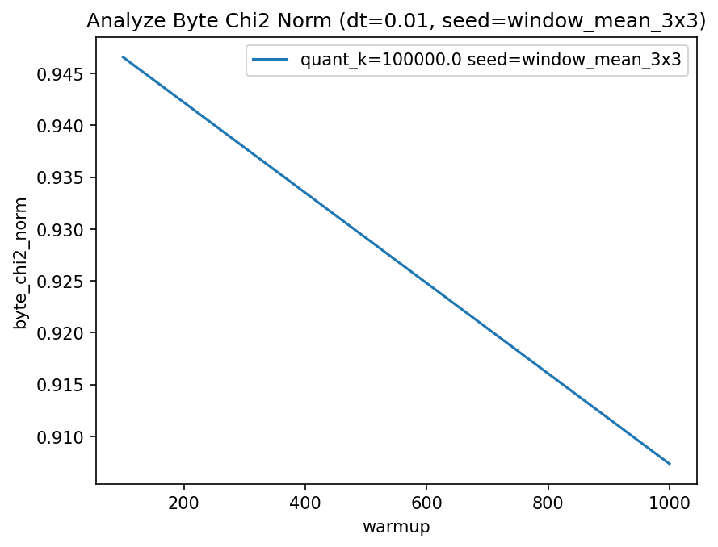

# ChaosCrypto WP2 – Report

## Inputs
- Benchmark CSV: `results.csv` (4 variants aggregated)
- Analyze CSV: `analysis.csv` (4 variants aggregated)
- Token: not stored; only fingerprints in source CSV

## Scope
- Profile: alice
- Coord: (12,34)
- nbytes: 4096
- Varying parameters:
  - dt: [0.01]
  - warmup: [100, 1000]
  - quant_k: [100000.0]
  - size: [128]
  - scale: [0.1]

## Benchmark Summary
Top throughput (mean over repeats):

| dt | warmup | quant_k | size | scale | seed_strategy | mean_t_keystream_s | mean_tp_bps | keystream_sha256 |
|---|---|---|---|---|---|---|---|---|
| 0.01 | 100 | 100000.0 | 128 | 0.1 | window_mean_3x3 | 0.00134002 | 3.07e+06 | 67b9783390c3d8cb046a865c44dcbdde4aa3c5a1ce567adac10a8a009e65515a |
| 0.01 | 100 | 100000.0 | 128 | 0.1 | neighborhood3 | 0.00143751 | 2.96e+06 | 850a5a0049420120022bb1c7f5d37fc40bdc33577af41ec810c936ab4ab2ec36 |
| 0.01 | 1000 | 100000.0 | 128 | 0.1 | neighborhood3 | 0.00144424 | 2.84e+06 | b8716987898d2d8a84c4fa23df62e0b86bc2f869443a64b5fe871cdcf0430f5e |
| 0.01 | 1000 | 100000.0 | 128 | 0.1 | window_mean_3x3 | 0.00158293 | 2.59e+06 | dcd678bae3e42ba688c4f7d28d7dd9c9a90ab5ddd55f65483b9ef09cd12974a0 |

## Analyze Summary
- Bit ones ratio min/mean/max: (0.498688, 0.500916, 0.503387)
- Runs norm diff min/mean/max: (0.002495, 0.005355, 0.007785)
- Byte chi2 norm min/mean/max: (0.907353, 0.92451, 0.946569)
- Autocorr lag1 min/mean/max: (-0.015602, -0.010742, -0.005021)

| dt | warmup | quant_k | size | scale | seed_strategy | bit_ones_ratio | byte_chi2_norm | runs_norm_diff | autocorr_lag_1 | keystream_sha256 |
|---|---|---|---|---|---|---|---|---|---|---|
| 0.01 | 100 | 100000.0 | 128 | 0.1 | neighborhood3 | 0.500854 | 0.913725 | 0.007539 | -0.015110 | 850a5a0049420120022bb1c7f5d37fc40bdc33577af41ec810c936ab4ab2ec36 |
| 0.01 | 100 | 100000.0 | 128 | 0.1 | window_mean_3x3 | 0.503387 | 0.946569 | 0.002495 | -0.005021 | 67b9783390c3d8cb046a865c44dcbdde4aa3c5a1ce567adac10a8a009e65515a |
| 0.01 | 1000 | 100000.0 | 128 | 0.1 | neighborhood3 | 0.498688 | 0.930392 | 0.007785 | -0.015602 | b8716987898d2d8a84c4fa23df62e0b86bc2f869443a64b5fe871cdcf0430f5e |
| 0.01 | 1000 | 100000.0 | 128 | 0.1 | window_mean_3x3 | 0.500732 | 0.907353 | 0.003602 | -0.007235 | dcd678bae3e42ba688c4f7d28d7dd9c9a90ab5ddd55f65483b9ef09cd12974a0 |

## Best Candidates (heuristic score)
| dt | warmup | quant_k | size | scale | seed_strategy | score | perf_score | rand_score | bit_ones_ratio | autocorr_lag_1 | runs_norm_diff | byte_chi2_norm |
|---|---|---|---|---|---|---|---|---|---|---|---|---|
| 0.01 | 100 | 100000.0 | 128 | 0.1 | window_mean_3x3 | 0.963733 | 1.000000 | 0.939554 | 0.503387 | -0.005021 | 0.002495 | 0.946569 |
| 0.01 | 100 | 100000.0 | 128 | 0.1 | neighborhood3 | 0.925872 | 0.963059 | 0.901081 | 0.500854 | -0.015110 | 0.007539 | 0.913725 |
| 0.01 | 1000 | 100000.0 | 128 | 0.1 | neighborhood3 | 0.917748 | 0.923639 | 0.913820 | 0.498688 | -0.015602 | 0.007785 | 0.930392 |
| 0.01 | 1000 | 100000.0 | 128 | 0.1 | window_mean_3x3 | 0.880826 | 0.843636 | 0.905619 | 0.500732 | -0.007235 | 0.003602 | 0.907353 |

## Plots

## Appendix
- CSV columns: benchmark includes timing/throughput; analyze includes keystream statistics.
- Reproducibility: same config → identical hashes/metrics.